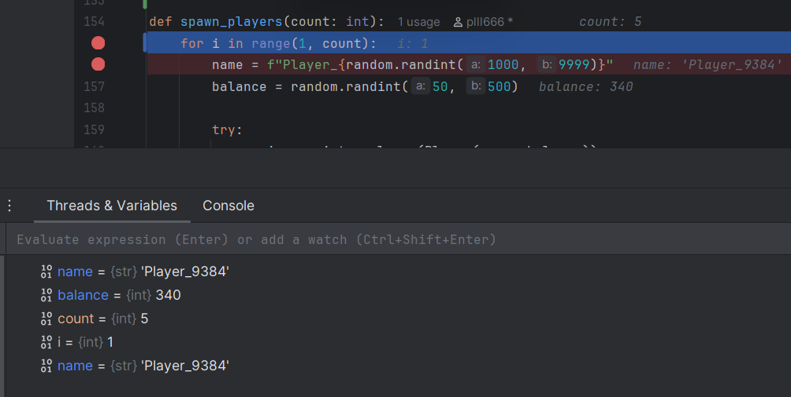
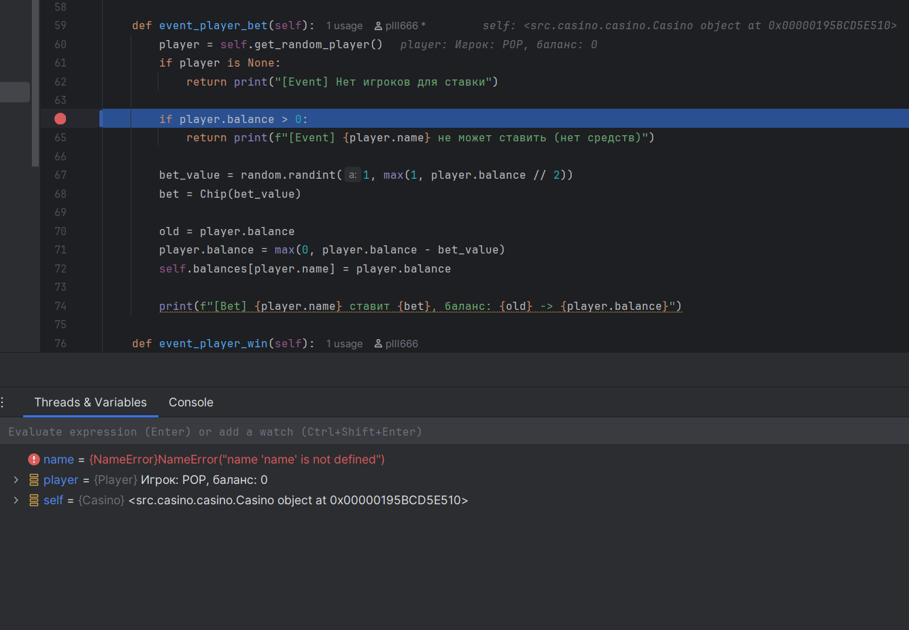
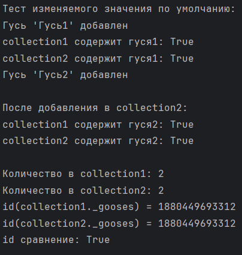
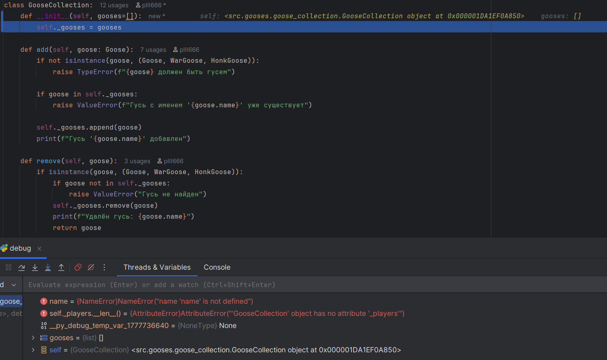
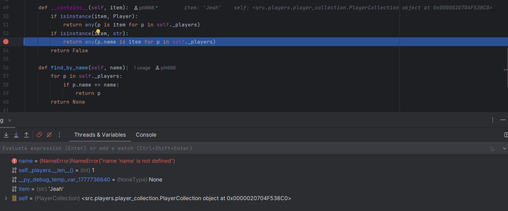
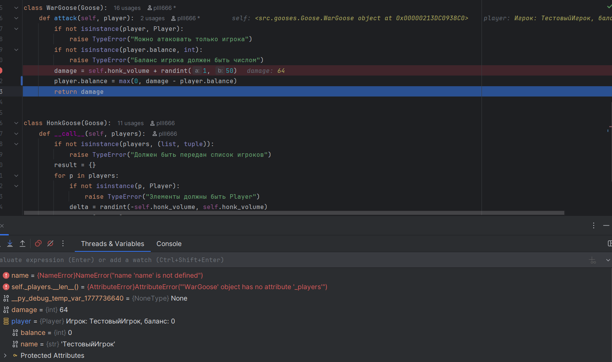

# Лабораторная работа №5
## Отладка кодовой базы проекта на Python

### Ошибка 1 — Ошибка границы цикла (off-by-one)
**Место:** `main.py`, метод `spawn_players`  
**Симптом:** Создаётся на одного игрока меньше указанного количества.  
**Воспроизведение:** `spawn players 5`: создаётся 4 игрока.  
**Отладка:** Breakpoint на `for i in range(1, count):`. Видно, что `i` начинается с 1, а должно с 0.  
**Причина:** Неправильные границы `range(1, count)` вместо `range(count)`.  
**Исправление:** Заменить на `for i in range(count)`.  
**Доказательства:** 

### Ошибка 2 — Неверное логическое условие
**Место:** `casino.py`, метод `event_player_bet`  
**Симптом:** Игрок с нулевым балансом может делать ставки.  
**Воспроизведение:** `add player POP 0`, далее `step`.  
**Отладка:** Breakpoint на `if player.balance > 0:`. При `balance=0` условие `False`, ставка выполняется.  
**Причина:** Условие инвертировано — должно быть `<=`.  
**Исправление:** Заменить на `if player.balance <= 0:`.  
**Доказательства:** 

### Ошибка 3 — Использование изменяемого значения по умолчанию  
**Место**: `goose_collection.py`, метод `__init__`  
**Симптом**: Коллекции разделяют данные: добавление в одну коллекцию влияет на другие.  
**Воспроизведение**: Создание двух GooseCollection с общим списком, добавление разных гусей.  
**Отладка**: Breakpoint на self._gooses = gooses. Проверка id(collection1._gooses) == id(collection2._gooses).  
**Причина**: Использование [] как значения по умолчанию параметра.  
**Исправление**: Заменить gooses=[] на gooses=None, создать новый список при None.    
**Доказательства**:         
    

### Ошибка 4 — Сравнение через is вместо ==
**Место:** `player_collection.py`, метод `__contains__`  
**Симптом:** Поиск игрока по имени не работает.  
**Воспроизведение:** Проверка `"Jeah" in players` возвращает `False` при наличии игрока.  
**Отладка:** Breakpoint на `p.name is item`. Видно разные `id()` у одинаковых строк.  
**Причина:** `is` сравнивает идентичность объектов, а не равенство значений.  
**Исправление:** Заменить на `p.name == item`.  
**Доказательства:**   

### Ошибка 5 — Перепутанные аргументы в формуле ущерба  
**Место**: `Goose.py`, метод attack класса WarGoose  
**Симптом**: Игроки теряют все деньги или получают деньги при атаке.  
**Воспроизведение**: Запустить `bug5.py`  
**Отладка**: Breakpoint на player.balance = max(0, damage - player.balance). Видно перепутанные аргументы.  
**Причина**: Используется damage - player.balance вместо player.balance - damage.  
**Исправление**: Заменить на player.balance = max(0, player.balance - damage).  
**Доказательства**:   